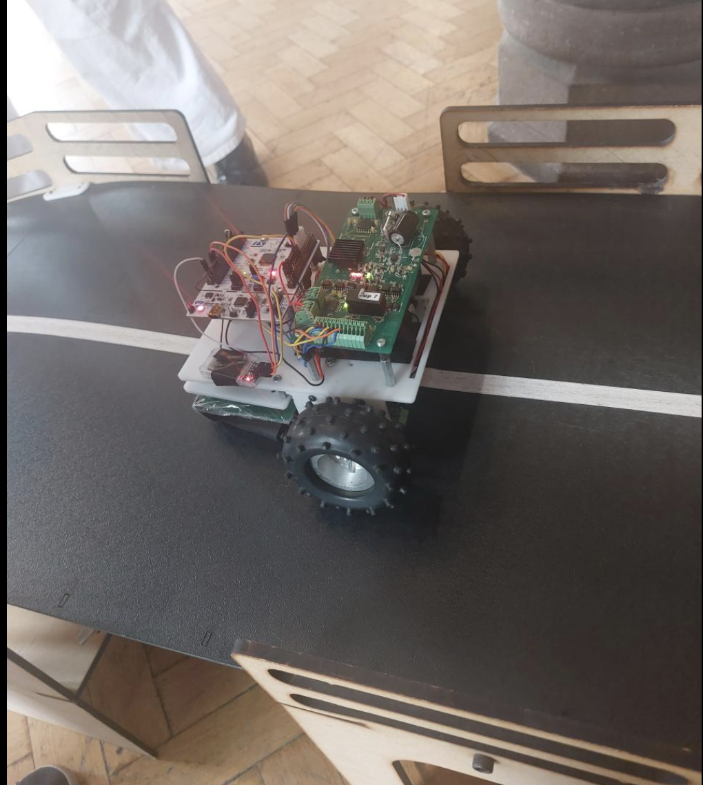

# 💫 About Me:
I am currently working on Python and C++ projects.

## 🌐 Socials:

# 💻 Tech Stack:

# 📊 GitHub Stats:
 
 

## ARM-based STM32F401 Code for Autonomous Buggy

### System Design and Hardware Components

Leveraging the power of an ARM-based STM32F401 microcontroller on Keil Studio, we successfully implemented line-following algorithms, overcoming numerous challenges along the way. Throughout this project, I covered the entire product life cycle:

- **System Design**: Led the design and development of both software and hardware components.
- **Sensor Selection**: Coordinated tests on various sensors, ultimately selecting the TCRT 5000 sensor based on data and practicality.

### Control Algorithms and Remote Functionality

Our project also involved developing advanced control algorithms and remote control functionality:
- **Sensor Array and Control**: Designed and engineered a 5-sensor array using Altium software, implementing object-oriented programming concepts and the weighted average algorithm.
- **Navigation Control**: Developed a two-layer cascaded control loop, utilizing MATLAB to determine control values.
- **Remote Control**: Integrated Bluetooth for remote control, using serial byte values for controlled stop, line following, and 360-degree turn commands.

### ✍️ Random Dev Quote

---

